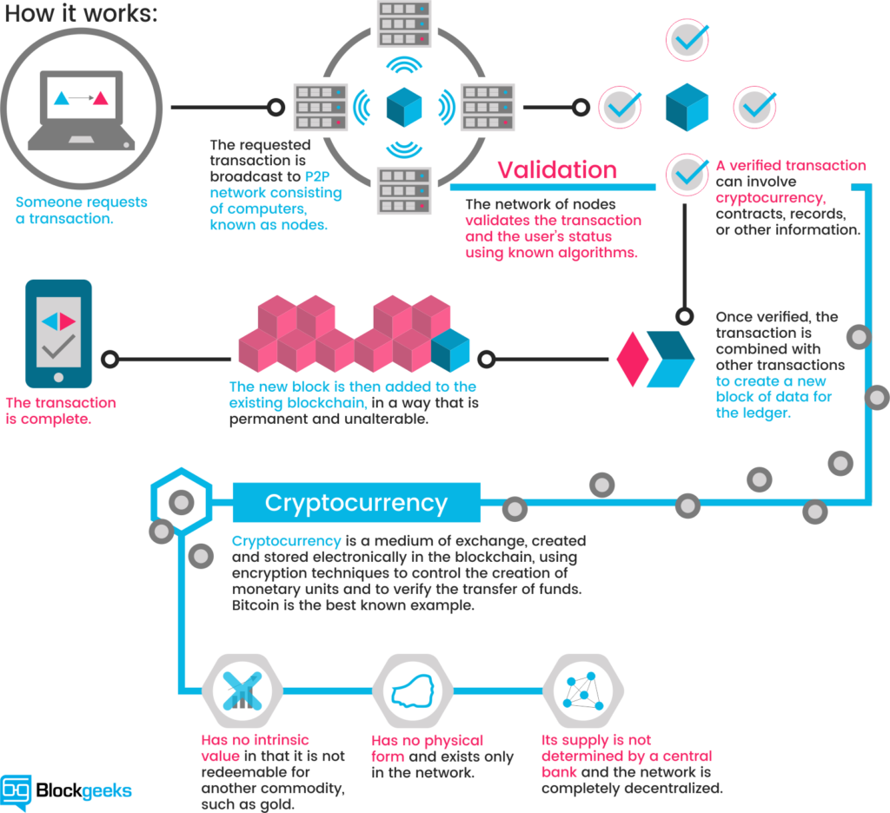

# Mining

## How miners create coins and confirm transactions

Let‘s have a look at the mechanism ruling the databases of cryptocurrencies. A cryptocurrency like Bitcoin consists of a network of peers. Every peer has a record of the complete history of all transactions and thus of the balance of every account.

A transaction is a file that says, “Bob gives X Bitcoin to Alice“ and is signed by Bob‘s private key. It‘s basic public key cryptography, nothing special at all. After signed, a transaction is broadcasted in the network, sent from one peer to every other peer. This is basic p2p-technology. Nothing special at all, again.

  

The transaction is known almost immediately by the whole network. But only after a specific amount of time it gets confirmed.

Confirmation is a critical concept in cryptocurrencies. You could say that cryptocurrencies are all about confirmation.

As long as a transaction is unconfirmed, it is pending and can be forged. When a transaction is confirmed, it is set in stone. It is no longer forgeable, it can‘t be reversed, it is part of an immutable record of historical transactions: of the so-called blockchain.

Only miners can confirm transactions. This is their job in a cryptocurrency-network. They take transactions, stamp them as legit and spread them in the network. After a transaction is confirmed by a miner, every node has to add it to its database. It has become part of the blockchain.

For this job, the miners get rewarded with a token of the cryptocurrency, for example with Bitcoins. Since the miner‘s activity is the single most important part of cryptocurrency-system we should stay for a moment and take a deeper look on it.
